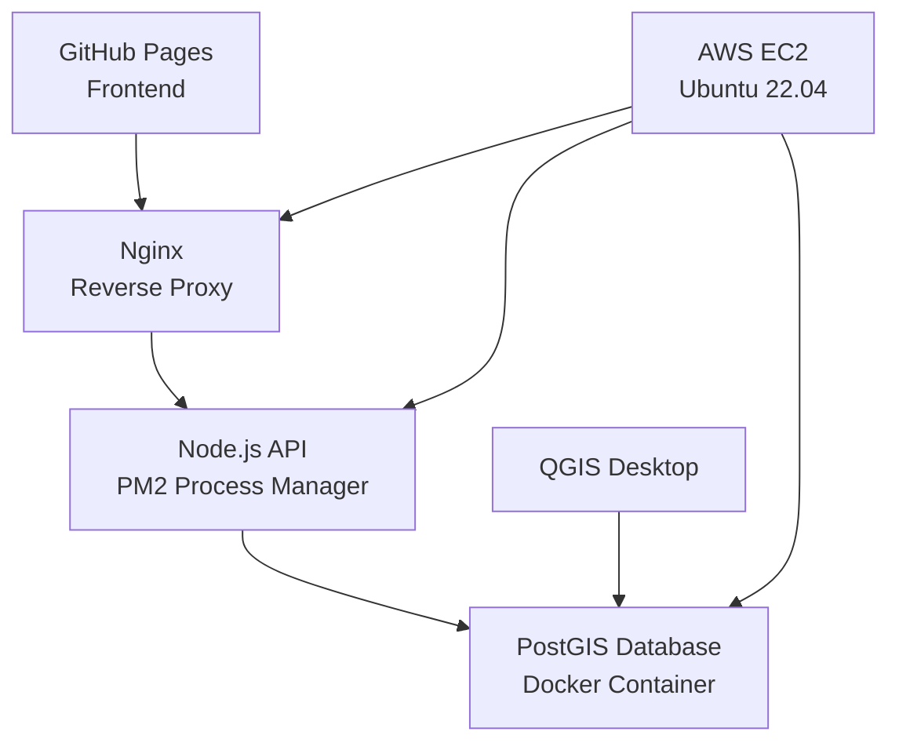

# 🗺️ PostGIS Istanbul Explorer

<div align="center">

[](https://mihracnar.github.io/postgis-frontend/)
[](https://13.60.90.28/api/health)

**Interactive spatial data exploration with PostGIS and real-time mapping**

[🎯 Demo](#-demo) • [✨ Features](#-features) • [🛠 Tech Stack](#-tech-stack) • [🚀 Quick Start](#-quick-start) • [📡 API](#-api)

</div>

---

## 🎯 Demo

### 🌟 Live Application
**Frontend**: https://mihracnar.github.io/postgis-frontend/  
**API**: https://13.60.90.28/api/health

> *Interactive map with 8 Istanbul landmarks, real-time spatial queries, and category filtering*

---

## ✨ Features

🗺️ **Interactive Mapping**
- Real-time map visualization with Leaflet.js
- Click-to-search spatial queries
- Category-based filtering with color-coded markers

🛢️ **Spatial Database**
- PostGIS-powered spatial data storage
- Advanced spatial queries (distance, buffer, intersection)
- GIST spatial indexing for performance

🔌 **REST API**
- RESTful endpoints for CRUD operations
- Spatial query endpoints for nearby search
- CORS-enabled with error handling

☁️ **Cloud Deployment**
- AWS EC2 hosting with SSL
- Docker containerization
- PM2 process management

---

## 🛠 Tech Stack

### Backend


### Frontend


### Infrastructure


---

## 🚀 Quick Start

### Prerequisites
- AWS Account (free tier)
- GitHub Account
- QGIS (optional)

### 1️⃣ Clone Repository
```bash
git clone https://github.com/mihracnar/postgis-frontend.git
cd postgis-frontend
```

### 2️⃣ Deploy Backend (AWS EC2)
```bash
# Launch t2.micro instance with Ubuntu 22.04
# Configure security groups: SSH(22), HTTP(80), HTTPS(443), Custom(3000,5432)

# Connect and install dependencies
ssh -i your-key.pem ubuntu@your-ec2-ip
curl -fsSL https://get.docker.com | sh
sudo usermod -aG docker ubuntu
```

### 3️⃣ Setup PostGIS Database
```bash
# Create docker-compose.yml
cat > docker-compose.yml << 'EOF'
version: '3.8'
services:
  postgis:
    image: postgis/postgis:13-3.1
    container_name: postgis_db
    environment:
      POSTGRES_DB: gisdb
      POSTGRES_USER: gisuser
      POSTGRES_PASSWORD: gispass123
    ports:
      - "5432:5432"
    volumes:
      - postgis_data:/var/lib/postgresql/data
volumes:
  postgis_data:
EOF

docker-compose up -d
```

### 4️⃣ Deploy Frontend
```bash
# Update API endpoint in js/api.js
const API_CONFIG = {
    BASE_URL: 'https://YOUR_EC2_IP/api',
    // ...
};

# Push to GitHub and enable Pages
git add . && git commit -m "Deploy to GitHub Pages"
git push origin main
```

### 5️⃣ Connect with QGIS
```
Host: YOUR_EC2_IP
Port: 5432
Database: gisdb
Username: gisuser
Password: gispass123
```

---

## 📡 API

### Base URL
```
https://YOUR_EC2_IP/api
```

### Endpoints

| Method | Endpoint | Description |
|--------|----------|-------------|
| `GET` | `/health` | API health check |
| `GET` | `/points` | Get all points |
| `POST` | `/points` | Add new point |
| `GET` | `/points/category/:category` | Filter by category |
| `GET` | `/nearby?lat=&lng=&radius=` | Spatial search |
| `GET` | `/categories` | Get all categories |
| `GET` | `/stats` | Get statistics |

### Example Usage
```javascript
// Get all points
fetch('https://YOUR_EC2_IP/api/points')
  .then(response => response.json())
  .then(data => console.log(data));

// Add new point
fetch('https://YOUR_EC2_IP/api/points', {
  method: 'POST',
  headers: { 'Content-Type': 'application/json' },
  body: JSON.stringify({
    name: 'New Location',
    category: 'Restaurant',
    description: 'Great food place',
    lat: 41.0123,
    lng: 28.9876
  })
});

// Spatial search
fetch('https://YOUR_EC2_IP/api/nearby?lat=41.0082&lng=28.9784&radius=1000')
  .then(response => response.json())
  .then(nearbyPoints => console.log(nearbyPoints));
```

---

## 🎮 Usage

### Adding Points
1. 🖱️ **Click** on the map to set coordinates
2. 📝 **Fill** the "Add New Point" form
3. 🏷️ **Select** category from dropdown
4. ➕ **Click** "Add Point" button

### Spatial Search
1. 🎯 **Enable** "Click to Search" mode
2. 🖱️ **Click** anywhere on the map
3. 👀 **View** nearby points within radius
4. 📍 **Results** highlighted on map

### Category Filtering
1. 🏷️ **Click** any category in sidebar
2. 🗺️ **Map** shows only that category
3. 🔄 **Toggle** off by clicking again
4. 👁️ **Use** "Show All" to reset

---

## 🔧 Architecture



---

## 🤝 Contributing

1. 🍴 **Fork** the repository
2. 🌿 **Create** your feature branch (`git checkout -b feature/amazing-feature`)
3. 💾 **Commit** your changes (`git commit -m 'Add amazing feature'`)
4. 📤 **Push** to the branch (`git push origin feature/amazing-feature`)
5. 🔄 **Open** a Pull Request

---

## 📊 Project Stats

<div align="center">


**Lines of Code**: ~2,000 • **API Endpoints**: 8 • **Technologies**: 15+

</div>

---

## 📄 License

This project is licensed under the MIT License - see the [LICENSE](LICENSE) file for details.

---

<div align="center">

**⭐ If you found this project helpful, please give it a star!**

Made with ❤️ by [Mihrac Nar](https://github.com/mihracnar)

[](https://github.com/mihracnar)
[](https://github.com/mihracnar/postgis-frontend)

</div>
